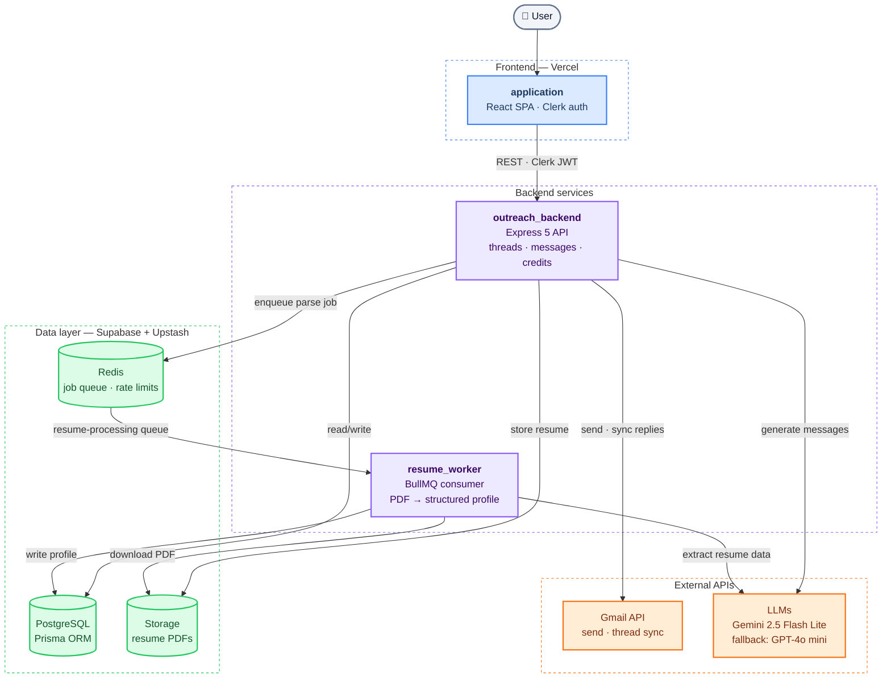
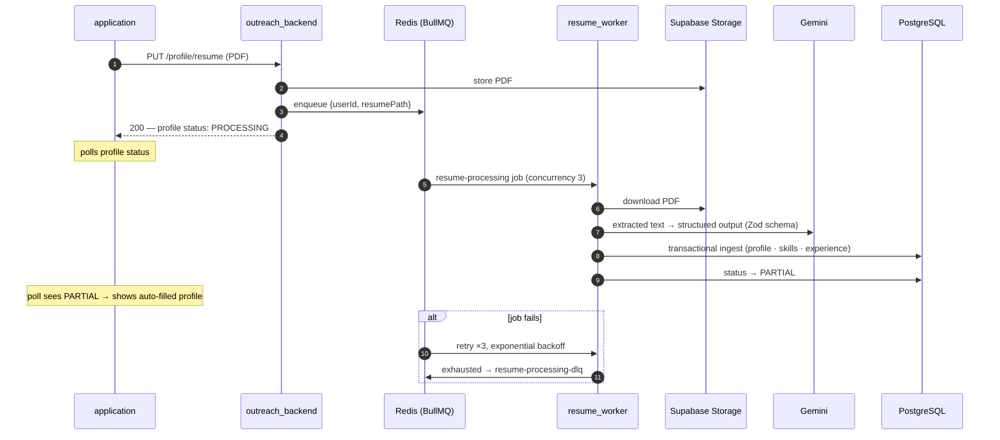

# ReferMate — AI-powered referral outreach

> Job seekers get referrals by messaging employees at target companies. ReferMate automates the grind: it reads the job description, your resume, and the company context, then generates referral requests and follow-ups that don't sound like templates — and sends them from your own Gmail.

**Live:** [refermate.novacraftsai.com](https://refermate.novacraftsai.com/) · **Walkthrough:** _[2-min video — coming soon]_

<!-- TODO(media): hero screenshot or 20-sec GIF of generating a message -->

## Why this exists

Referrals are one of the highest-converting paths to an interview, but personalizing outreach for every role takes 15–20 minutes per message. ReferMate cuts that to seconds while keeping messages context-aware — tailored to the company, the role, and what's actually in your resume.

## How it works

1. **Upload your resume** — a background worker parses it into structured data (experience, skills, projects) that grounds every message
2. **Add a job and a contact** — paste the job description and the employee you want to reach
3. **Generate the message** — cold intro, tailored referral request, follow-up, or thank-you, grounded in your real experience mapped to the role's requirements
4. **Send from your own Gmail** — replies sync back automatically, so you track every conversation, schedule follow-ups, and mark outcomes in one dashboard

## Architecture

Monorepo with four deployable units:

```
refermate/
├── landing/            # Marketing site — React 19 + Vite
├── application/        # User app — React 18 + Vite SPA, Clerk auth, TanStack Query, shadcn/ui
├── outreach_backend/   # API — Express 5 + TypeScript, LLM orchestration, Gmail integration, credits
└── resume_worker/      # Async worker — BullMQ consumer, resume parsing via Gemini structured output
```



The two flows at a glance: **message generation** runs synchronously through the API (`application → API → LLM router → Gmail`), while **resume parsing** is fully async (`API → Redis queue → resume_worker → Postgres`) — the app polls the profile status instead of waiting.

<details>
<summary><b>Zoom in: the async resume pipeline</b> — enqueue, retries, dead-letter queue</summary>

<br/>



Ingestion is built to be safely re-runnable (retries mean any step can execute twice) — details in [resume_worker/README.md](resume_worker/README.md).

</details>

## Key technical decisions

- **Resume parsing is a separate worker, not an API call.** PDF parsing is slow and failure-prone (format variance, LLM latency), so uploads enqueue a BullMQ job and return immediately. The worker runs 3 jobs concurrently, retries 3× with exponential backoff, and dead-letters exhausted jobs — a bad file never blocks the UI or burns an API timeout. The frontend polls a profile status machine (`INCOMPLETE → PROCESSING → PARTIAL → COMPLETE`) instead of holding a request open.
- **One LLM interface, multiple vendors.** Generation tries Gemini 2.5 Flash Lite first and falls back to GPT-4o mini, behind a single `callLLM` — adding a vendor is a config entry, not a refactor. Every response is parsed through LangChain structured output against a Zod schema, so the app never string-scrapes LLM text: output is valid `{subject, body}` JSON or the call fails cleanly and the credit is refunded.
- **Gmail is the source of truth for conversations.** No mail infrastructure to run and no email bodies to store: messages go out as RFC822 MIME through the Gmail API, and the DB keeps only Gmail's thread/message IDs. Replies sync lazily on view — fetched, deduplicated by external ID, quote blocks stripped. Deliverability and history stay in the user's own inbox.
- **Each message type is a strategy, not a branch of one mega-prompt.** Cold, tailored, follow-up, and thank-you each own a prompt template and compose different context — resume data, job description, prior thread messages. New types plug into the strategy map without touching the core service.
- **Credits gate generation, not sending.** A credit is deducted when the LLM runs — the expensive step — and refunded if the call fails. Per-user, Redis-backed rate limiting sits in front of the API, so limits hold across instances.
- **Auth is boring on purpose.** Clerk handles sessions, Google OAuth, and Svix-verified webhooks — vendor solutions for solved problems; the engineering time went into the generation and Gmail pipelines instead.

## Stack

| Layer | Tech |
|---|---|
| **Frontend** | React 18 + Vite, React Router v7, TanStack Query v5, Tailwind v4 + shadcn/ui |
| **Backend** | Express 5, TypeScript, Zod validation, Prisma ORM |
| **AI** | LangChain, Gemini 2.5 Flash Lite (primary), GPT-4o mini (fallback), structured output |
| **Data & infra** | PostgreSQL (Supabase), Upstash Redis + BullMQ, Supabase Storage, Vercel |
| **Auth & integrations** | Clerk (auth + Google OAuth), Gmail API, Svix webhooks |

## Running locally

Each package has a `.env.example` — copy it to `.env` and fill in keys. You'll need Postgres + Redis (free tiers of Supabase and Upstash work) and a Gemini API key.

```bash
git clone https://github.com/Sahil2012/refermate

# API
cd outreach_backend
npm i && npx prisma generate && npx prisma migrate deploy
npm run dev                      # http://localhost:5000

# Resume worker (separate terminal — needs Redis + Gemini key)
cd resume_worker
npm i && npx prisma generate
npm run dev

# User app (separate terminal)
cd application
npm i && npm run dev             # http://localhost:5173

# Landing (optional)
cd landing
npm i && npm run dev
```

Each service has its own README with the next level of depth: [outreach_backend](outreach_backend/README.md) (API surface, message lifecycle, state machines) · [resume_worker](resume_worker/README.md) (pipeline sequence diagram, failure handling) · [application](application/README.md) (screens, data-flow wiring) · [landing](landing/README.md)

## Status

Active beta. The core flow is live end-to-end: resume → structured profile → AI-generated outreach → Gmail send → reply syncing, follow-ups, and outcome tracking. In progress: payment integration for credit recharges and a richer template library.
