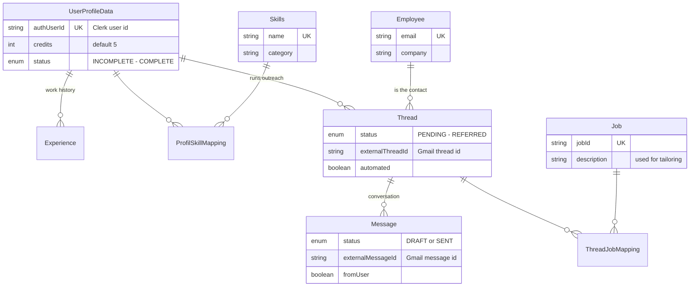

# outreach_backend

The ReferMate API — Express 5 + TypeScript. Owns all business logic: profiles, AI message generation, Gmail sending/syncing, thread tracking, and the credit system. See the [root README](../README.md) for the system-level picture.

## Request lifecycle

Every request flows through the same pipeline ([server.ts](src/server.ts)):

```
Clerk JWT extraction → requireAuth → Redis rate limiter (per-user, distributed)
→ Zod validation (body · query · params) → controller → service → Prisma → DTO mapper
```

Errors anywhere in the chain fall through to a global error handler that maps typed `HttpError`s to consistent JSON responses — controllers never hand-roll error payloads.

## API surface

| Route | Endpoints | Notes |
|---|---|---|
| `/auth` | `POST /webhook/clerk` · `GET /me` | Webhook is Svix-signature-verified; creates the user profile on Clerk signup |
| `/profile` | `GET /` · `PATCH /` · `PUT /resume` · `POST /credits/transaction` · `GET /stats` | Resume upload streams via busboy to Supabase Storage, then enqueues a parse job |
| `/messages` | `POST /` · `GET /types` · `GET·PATCH·DELETE /:id` · `POST /:id/send` | `POST /` generates via LLM (costs a credit); `/:id/send` delivers via Gmail |
| `/threads` | `GET /` · `GET /:id` · `PATCH /:id` | List is paginated + filterable; detail lazily syncs new replies from Gmail |

## How a message happens

**Generation** (`POST /messages`): deduct a credit → dispatch to the right strategy ([email/context.ts](src/service/email/context.ts)) — cold, tailored, follow-up, or thank-you, each composing its own context (profile + skills, job description, prior thread messages) into its own prompt template ([utils/prompts/](src/utils/prompts/)) → [callLLM](src/apis/llmClient.ts) tries Gemini 2.5 Flash Lite, falls back to GPT-4o mini → response parsed against a Zod schema into `{subject, body}` → draft saved atomically (thread + message + job mapping in one transaction). If the LLM fails, the credit is refunded.

**Sending** (`POST /messages/:id/send`): draft is assembled into an RFC822 MIME stream (Nodemailer, optional resume attachment via Supabase signed URL) → sent through the Gmail API as the user → Gmail's `threadId`/`messageId` stored as external references → thread status advances.

**Syncing** ([externalMailService.ts](src/service/externalMailService.ts)): on thread view, new replies are pulled from Gmail by external thread ID, deduplicated by external message ID, quote blocks stripped (Cheerio), and direction detected via Gmail's `SENT` label. The DB never stores what Gmail already owns.

## Data model

[prisma/schema.prisma](prisma/schema.prisma) — shared with [resume_worker](../resume_worker/), which writes the profile side while this service owns outreach.



Design notes: skills are a shared dictionary (unique by name) joined through `ProfilSkillMapping` with a compound unique constraint, so the same skill is never duplicated across users; threads↔jobs are many-to-many because one conversation can cover several roles; and the `external*Id` columns are the only coupling to Gmail — drop them and the outreach history still stands alone.

The two state machines that drive the product:

- **Thread**: `PENDING → SENT → FIRST/SECOND/THIRD_FOLLOW_UP → CLOSED | REFERRED` — one thread per contact, linked to jobs via a join table
- **Message**: `DRAFT → SENT`, with `externalMessageId` tying each row to its Gmail counterpart
- **UserProfileData**: `INCOMPLETE → PROCESSING → PARTIAL → COMPLETE` — advanced by [resume_worker](../resume_worker/) as parsing completes

## Layout

```
src/
├── routes/        # Route definitions + per-route middleware
├── middlleware/   # Auth, rate limiter, Zod validator, error handlers
├── controller/    # HTTP concerns only — parse, delegate, respond
├── service/       # Business logic; email/strategy/ holds the 4 generation strategies
├── mapper/        # DB model → API response DTOs
├── schema/        # Zod schemas for every request shape
├── apis/          # External clients: Prisma, LLM router, Gmail OAuth, Supabase, Redis
└── utils/         # Prompt templates, queue enqueue, logger
```

## Run

```bash
cp .env.example .env      # fill in keys — see comments in the file
npm i
npx prisma generate
npx prisma migrate deploy
npm run dev               # compiles + runs with --watch on :5000
```

Requires Postgres (Supabase), Redis (Upstash), a Gemini API key, and Clerk + Google OAuth credentials. `OPENAI_API_KEY` is optional — the LLM router simply skips vendors without keys.
