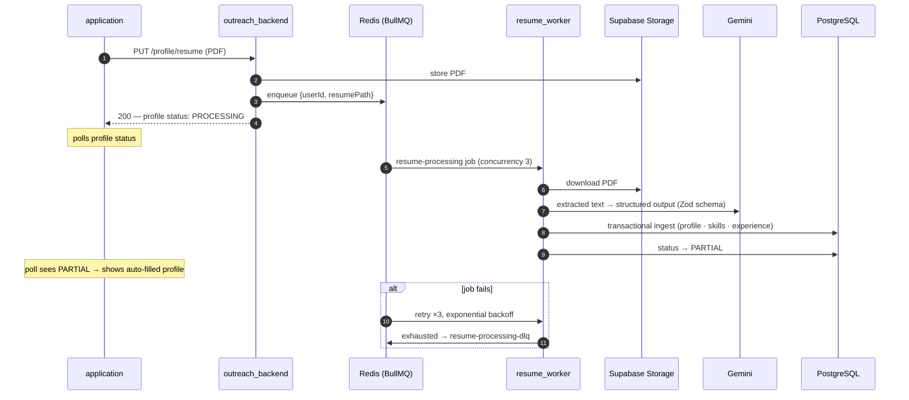

# resume_worker

Async resume-parsing worker for ReferMate. It exists so that slow, failure-prone PDF parsing never blocks the API: uploads return immediately, and this worker turns the PDF into the structured profile data that grounds every generated message. See the [root README](../README.md) for the system-level picture.

## The pipeline



**Extraction** (`extractDataFromResume.ts`): `pdf-parse` pulls the text, Gemini 2.5 Flash returns structured output validated against the Zod schema in `schema.ts` — experiences, skills (with categories), projects, notice period, achievements. The prompt instructs the model to extract only what's explicitly stated; anything else comes back `null`, never hallucinated.

**Ingestion** (`processResume.ts` + `src/ingestion/`) is built to be safely re-runnable, because retries mean any step can execute twice:

- Skills are deduplicated against the existing dictionary and inserted with `createMany({ skipDuplicates })`
- Experience uses delete-then-insert, so a retry can't double-append work history
- Skill lookups happen *before* the transaction opens, keeping the transaction short enough to avoid pool timeouts

## Failure handling

Jobs retry 3 times with exponential backoff (options set at enqueue time by the backend). After the third failure, the job payload is pushed to the `resume-processing-dlq` Redis list (`src/server.ts`) — nothing is silently dropped, and stuck resumes can be inspected and replayed:

```bash
redis-cli LRANGE resume-processing-dlq 0 -1
```

## Run

```bash
cp .env.example .env      # fill in keys
npm i
npx prisma generate       # same schema/database as outreach_backend
npm run dev
```

Requires the shared Postgres database, Redis (Upstash), Supabase Storage access, and a Gemini API key — see [.env.example](.env.example). There's no HTTP server to hit: trigger it end-to-end by uploading a resume through the app, or enqueue a job directly onto the `resume-processing` queue.
